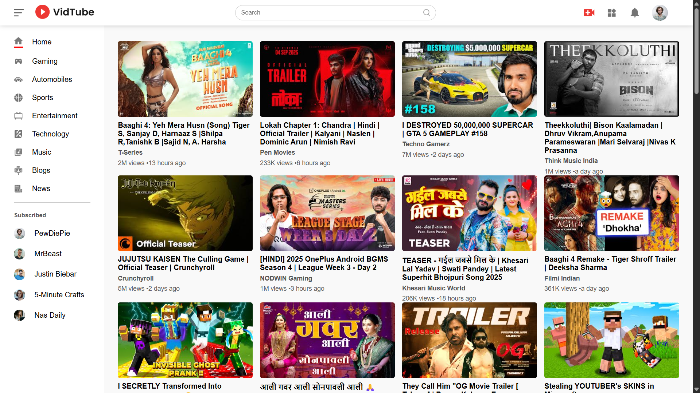
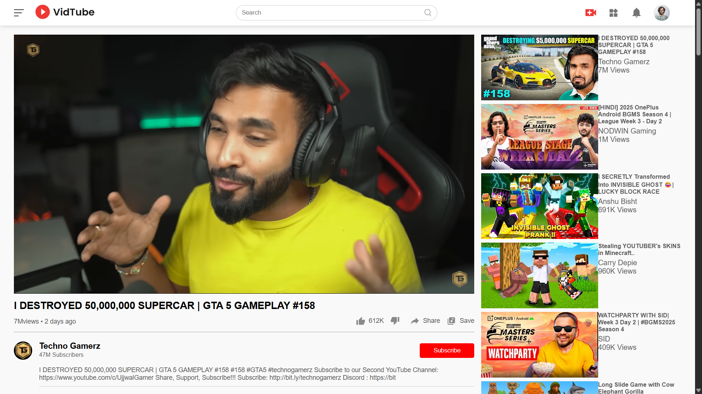

# 🎬 YouTube Clone

A fully functional **YouTube Clone Website** built with **React.js, Node.js, HTML, CSS**, and integrated with the **YouTube Data API** to fetch and display real-time video content.

---

## 🚀 Features
- 🔍 Search videos from YouTube using the YouTube Data API  
- ▶️ Play and stream videos with a responsive video player  
- 📂 Browse trending, categories, and related videos  
- 🖼️ Responsive design (works on desktop & mobile)  
- ⚡ Built with **React.js (Frontend)** and **Node.js (Backend)**  

---

## 🛠️ Tech Stack
- **Frontend:** React.js, HTML5, CSS3  
- **Backend:** Node.js  
- **API:** YouTube Data API v3  

---

## 📸 Snapshots

| Homepage | Video Player Page |
|----------|--------------------|
|  |  |

---

## 📂 Project Structure
youtube-clone/
│── client/ # React.js frontend
│── server/ # Node.js backend
│── public/ # Static files
│── components/ # components of the webapp
│── pages/ # various pages like homepage and vide-player page
│── assets/ # Screenshots & images
│── package.json # Dependencies
│── README.md # Documentation


---

## ⚙️ Installation & Setup

1. Clone the repository:
   ```bash
   git clone https://github.com/your-username/youtube-clone.git
   cd youtube-clone

2. Install dependencies for both frontend & backend:
   ```bash
   cd client
   npm install
   cd ../server
   npm install
   
3. Create a .env file in your server folder and add your YouTube Data API Key:
    ```env
    YOUTUBE_API_KEY=your_api_key_here
    
4. Run the development servers:
     ```bash
     cd youtube-clone
     npm run dev

📡 API Reference

YouTube Data API v3
Used for fetching video details, search results, and metadata.

🤝 Contributing

Contributions, issues, and feature requests are welcome!


📜 License

This project is licensed under the MIT License.


🌟 Show Your Support

If you like this project, ⭐ star the repo to support the developer!

     

  
